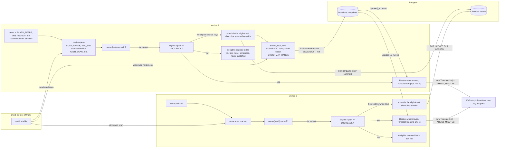

# POC: sharded baselines worker on VM and Kubernetes

[Русская версия](POC.ru.md)

Proof of concept for the v2 scaling model of `timeseries-baselines`: **N workers share one Druid table by
rendezvous hashing of `metric_hash`**, with no coordinator, no lock and no shared state.
Behaviour described here: worker `052c1a8`, chart value `baselines.replicas`.

> **v3 update.** v3 changes what a tick does, not how ownership works, so every check below still holds.
> Read it together with these differences:
>
> - A tick no longer fits and publishes per hash. It scans, claims due retrains, and publishes from a stored
>   snapshot; with `BASELINE_STORE_*` set, publishing issues **zero** Druid requests and survives a Druid outage.
> - Every Druid request is windowed and bounded (`DRUID_MAX_RANGE`, `DRUID_MAX_RPS`, `DRUID_MAX_INFLIGHT`,
>   `DRUID_TIMEOUT`, `DRUID_RETRIES`). The scan is windowed too, so the eligibility span is `SCAN_RANGE`
>   (default `max(2*LOOKBACK, 24h)`), not all history: a hash whose data ended before `now - SCAN_RANGE` stops
>   being eligible.
> - Eligibility itself is unchanged (`span >= LOOKBACK`), and the store path applies it at every decision it makes:
>   a hash below it gets no schedule row, is not published even with a stored snapshot, holds no fit in memory,
>   and a stale row for one is finished as an error instead of being trained on the window that is left.
> - The published timestamp is minute-truncated `now` + `AHEAD_MINUTES`, not the last observed point + N.
> - `SHARD_MEMBERSHIP` (`auto` by default) selects the peer source: `SHARD_PEERS`, then `SHARD_DNS`, then the
>   Postgres heartbeat (`store`), then this worker alone. **`store` is the recommended VM path**: the peer set is
>   the `baselines.workers` rows seen within `WORKER_TTL` (default `max(30s, 2*INTERVAL)`), so join/leave needs no list edit.
> - `SHARD_PEERS` / `SHARD_DNS` still behave exactly as described below, including the negative controls.

## What this POC proves

| Claim | How it is checked here |
| --- | --- |
| Work is split, not duplicated | Two or more workers publish pairwise **disjoint** hash sets that together cover every ready hash |
| Ownership needs no coordinator | Workers never talk to each other; the only shared systems are Druid (work source) and Kafka (output) |
| Scaling moves little | Adding/removing one worker moves about `1/N` of the hashes; the rest keep their owner |
| A scale event loses at most one tick | The new owner publishes its own wall-clock horizon on its next tick; no backfill |
| A retrain never skips a minute | The tick's horizon comes from the clock it read at its start, so a scan and a sliced retrain that run past the minute still publish it |
| A slow Druid cannot stop publishing | With `BASELINE_STORE_*` set the publish path reads only the snapshot cache: zero Druid requests and no `Series` call in steady state |
| Duplicates cannot corrupt values | Ingestion collapses a repeated `(metric_hash, metric_ts)` (`doubleMax` with minute rollup), and the dashboard reads `MAX(baseline_value)` |
| A wrong peer list degrades visibly | A static list with a peer that is not running strands that peer's share (negative control, VM) |



The tick's order is scan → ownership → eligibility (`span >= LOOKBACK`) → publish from the snapshot: a
schedule row is created only for eligible owned hashes, a retrain trains only those, and an owned hash below
`LOOKBACK` gets neither a row nor a point — it is counted as `ineligible` in the tick line
(`published`/`retrained`/`ineligible`/`skipped`).

Ownership is `owner(hash) = argmax(avalanche(fnv1a(hash | peer)))` over the peer set, so every worker
computes the same answer from the same set alone.

## Prerequisites

- `timeseries-baselines` built: `make linux` (Linux amd64 into `bin/baselines`), or `go build ./cmd/baselines` on the VM
- Druid with a `metrics` table of `{metric_hash, metric_ts → __time, metric_value}`, where at least one hash has
  `max(__time) - min(__time) >= LOOKBACK` (default `336h`) and a 1-minute step
- Kafka with the `baselines` topic
- The Druid Kafka supervisor for `baselines` using `"type": "doubleMax"` for `baseline_value` with
  `"queryGranularity": "minute"` and `"rollup": true` (see the sandbox `druid/baselines-supervisor.json`)
  - Changing that aggregator needs more than editing the file: re-submit the spec **and** re-index the
    datasource (reset the supervisor, or rebuild it). Rollup is applied at ingestion, so minutes that are
    already stored keep the old aggregation — a stack indexed with `doubleSum` holds doubled values that no
    dashboard query can undo. Submitting a supervisor spec only affects new ingestion.
- Optional: the sandbox stack (`make up`, `make refresh`) for the dashboard and `make baselines`

| Env | Meaning |
| --- | --- |
| `DRUID_BROKER`, `DRUID_DATASOURCE`, `KAFKA_BROKERS`, `KAFKA_TOPIC` | Same as v1 |
| `LOOKBACK`, `AHEAD_MINUTES`, `INTERVAL`, `CALENDAR` | Same as v1 |
| `DRUID_MAX_RANGE`, `DRUID_MAX_RPS`, `DRUID_MAX_INFLIGHT`, `DRUID_TIMEOUT`, `DRUID_RETRIES` | v3 Druid bounds: maximum span per request, requests per second, concurrent requests, client timeout, retries |
| `HASH_SCAN_TTL`, `SCAN_RANGE` | v3 scan cache and eligibility window |
| `BASELINE_STORE_*` | v3 Postgres snapshot/retrain/membership store (falls back per field to `FORECAST_STORE_*`). Unset: fit-and-publish per tick, v1/v2 behaviour |
| `DEFAULT_RETRAIN_CRON`, `RETRAIN_RETRY`, `TRAIN_CONCURRENCY`, `SNAPSHOT_CACHE_TTL` | v3 retrain schedule, retry/lease delay, concurrent retrains, snapshot freshness probe |
| `SHARD_MEMBERSHIP` | `auto` (default), `peers`, `dns`, or `store` |
| `WORKER_TTL` | A `baselines.workers` row is a peer while it was seen within this (default `max(30s, 2*INTERVAL)`, and always longer than `INTERVAL`) |
| `SHARD_ID` | This worker's identity. Default: first non-loopback IP |
| `SHARD_PEERS` | Comma-separated peer identities (VM mode) |
| `SHARD_DNS` | Name whose A records are the peer set (Kubernetes headless Service, Compose service name) |

Empty `SHARD_PEERS`, `SHARD_DNS`, and store mean one worker owns every hash. Setting both `SHARD_PEERS` and `SHARD_DNS` is a startup error.

## Step 0 — local check, no Druid and no Kafka (~1 s)

```bash
cd timeseries-baselines
go test ./... -run 'Shard|Owns|Peer|Publisher' -v
```

Expected: `TestPublisherWorkersOwnDisjointHashes` passes (disjoint and complete across three workers),
`TestOwnsPartitionsEveryHashOnce` passes for 1..6 peers, `TestOwnsSpreadsHashesAcrossSimilarPeers` passes
(peers named `worker-0..4` split the table evenly — this is the hash-avalanche regression, without it
ownership followed the peer name and one peer change moved half the table),
`TestPublisherTakesOverHashesAfterPeerLeaves` passes, `TestOwnsKeepsMostHashesWhenPeerAdded` passes
(about 1/5 of the hashes move on the fifth peer).

This is the same ownership code that runs in the workers; it proves the algorithm and the peer-set modes,
not the deployment.

## Step 1 — VM: three workers with a static peer list

Mode: `SHARD_PEERS`. Identities are opaque strings, so `w0/w1/w2` is enough — no need for IPs.

```bash
# /etc/baselines/env — shared by every instance
DRUID_BROKER=http://druid-broker:8082
DRUID_DATASOURCE=metrics
KAFKA_BROKERS=kafka-1:9092,kafka-2:9092
KAFKA_TOPIC=baselines
LOOKBACK=336h
AHEAD_MINUTES=1
INTERVAL=1m
SHARD_PEERS=w0,w1,w2
```

```ini
# /etc/systemd/system/baselines@.service
[Unit]
Description=Minute-of-week baselines worker (shard %i)
After=network-online.target

[Service]
EnvironmentFile=/etc/baselines/env
Environment=SHARD_ID=%i
ExecStart=/usr/local/bin/baselines
Restart=always
RestartSec=5
User=baselines

[Install]
WantedBy=multi-user.target
```

```bash
systemctl enable --now baselines@w0 baselines@w1 baselines@w2
journalctl -u 'baselines@*' -n 20 --no-pager   # each unit logs its own shard
```

Expected in each startup line: `shard=w0 shardPeers="[w0 w1 w2]" shardDNS=""` (one line per instance, with
`w1`/`w2` respectively), then no further output while the stack is healthy.

Two processes on **one host** would auto-detect the same identity, so with a static list always set
`SHARD_ID` explicitly per instance (the unit above does). Give separate VMs explicit identities too: the
default is the first non-loopback IP, and two VMs in different networks can report the same private address —
they then count as one peer and each duplicates the other's share.

A static fleet only agrees if every worker is configured identically:

- the **same** `SHARD_PEERS` (the whole fleet, each worker included) and unique `SHARD_ID`s, or two workers
  compute different owners for the same hash;
- the **same** `LOOKBACK`. Eligibility runs *after* ownership, so a hash owned by a worker with a shorter
  lookback is published by nobody;
- the same `DRUID_BROKER`, `DRUID_DATASOURCE`, `KAFKA_BROKERS`, and `KAFKA_TOPIC` — otherwise the workers are
  not sharing one table at all.

Change the list **before** stopping a process: a name that is listed but has no process strands its share
silently. Adding a worker is safe in either order — while the old and new lists disagree the worst case is a
duplicate point, which `doubleMax` swallows.

### Verify the split from the data

Kafka (no duplicates, which is the steady-state claim):

```bash
kafka-console-consumer.sh --bootstrap-server localhost:9092 --topic baselines \
  --from-beginning --timeout-ms 5000 \
  | jq -r '[.metric_hash, .metric_ts] | @tsv' | sort | uniq -cd
```

Expected: empty. Any output is a repeated `(metric_hash, metric_ts)`, which ingestion must swallow.

Druid coverage (every ready hash keeps producing lead points):

```sql
SELECT metric_hash, COUNT(*) AS points, MAX(__time) AS last_point
FROM baselines
GROUP BY 1
ORDER BY 1
```

### Negative control (VM) — a peer that is not running

```bash
systemctl stop baselines@w2
# then, on the remaining host, temporarily list the stopped peer as still present:
# SHARD_PEERS=w0,w1,w2 with only w0 and w1 running
```

Expected: `w0` and `w1` each publish only their own share, and `w2`'s share **disappears from Kafka** until
`w2` returns or the list is corrected. This is the documented trap: a static list must match the running
workers. Remove `w2` from `SHARD_PEERS` (and restart the units) to watch coverage come back within one tick
— `w0`/`w1` take over its share with no data migration.

## Step 2 — Kubernetes: scale a Deployment

Mode: `SHARD_DNS`. The chart gives the worker its own Deployment plus a headless Service; `SHARD_ID` is the
pod IP (`status.podIP`) and `SHARD_DNS` is the bare Service name, which resolves through the pod's search
domains — so it works on a cluster with a custom `--cluster-domain` too.

```bash
# from timeseries-k8s
make docker-baselines                     # builds the image from the pinned worker commit
helm upgrade --install timeseries charts/timeseries -n timeseries --create-namespace \
  -f ../timeseries-grafana-sandbox/helm/timeseries-values.yaml \
  --set baselines.replicas=1
```

`docker/baselines/Dockerfile` fetches the worker source from GitHub by pinned ref (`BASELINES_REF`), so that
commit must be pushed to the remote before the image builds — a local-only commit is not enough.

Sanity check of the rendered objects before/without a cluster:

```bash
helm template test charts/timeseries -f ci/values.yaml --set baselines.replicas=3 | \
  grep -E "name: test-baselines|replicas:|SHARD_|clusterIP"
```

Expected: one `Service` named `test-baselines-headless` with `clusterIP: None`, one `Deployment` named
`test-baselines` with `replicas: 3`, and `SHARD_ID` (`fieldRef: status.podIP`) / `SHARD_DNS`.

Scale and inspect the peers:

```bash
kubectl -n timeseries scale deployment/timeseries-baselines --replicas=3
kubectl -n timeseries get pods -l app.kubernetes.io/component=baselines -o wide
kubectl -n timeseries get endpoints timeseries-baselines-headless
kubectl -n timeseries logs -l app.kubernetes.io/component=baselines --tail=1
```

Expected: three pods with three distinct IPs, the headless Service endpoint list showing exactly those IPs,
and three startup lines with `shard=<pod ip> shardDNS=timeseries-baselines-headless...`. The identities in
the logs match the endpoint IPs one for one.

### Verify the split from inside the cluster

```bash
kubectl -n timeseries run dnstest --rm -it --restart=Never --image=busybox:1.36 \
  -- nslookup timeseries-baselines-headless
```

Expected: one address per running worker pod. This is the whole membership mechanism — the workers read the
Service DNS record, they never contact each other.

### Scale events

```bash
kubectl -n timeseries scale deployment/timeseries-baselines --replicas=5   # more capacity, ~1/5 moves
kubectl -n timeseries scale deployment/timeseries-baselines --replicas=2   # fewer workers, ~1/3 moves
kubectl -n timeseries rollout restart deployment/timeseries-baselines       # pods get new IPs: ~1/N moves twice
```

Expected after each change: the surviving/new workers pick up their share on their next tick. On scale-up
or restart some hashes are published by both the old and the new owner for one tick; ingestion collapses
those. On scale-down the departing share is silent for at most one tick.

`kubectl scale` changes the live replica count only: the next `helm upgrade` resets `replicas` to
`baselines.replicas`, so pass the intended count there (`--set baselines.replicas=N`) or scale again after the
upgrade.

### Negative control (k8s) — the same identity twice

```bash
kubectl -n timeseries set env deployment/timeseries-baselines SHARD_DNS=   # every pod now owns everything
# later:
kubectl -n timeseries set env deployment/timeseries-baselines SHARD_DNS=timeseries-baselines-headless
```

Expected: with discovery off, every pod publishes every hash — the Kafka duplicate check below fills up with
repeats, and `MAX(baseline_value)` in Druid is **unchanged**. That is the point of the idempotency contract:
duplicate work is wasteful but harmless.

## Step 3 — verify that duplicates do not double the value

Take a baseline minute from a single-replica run, then repeat it with three replicas (use a window both runs
cover, and older than `now - AHEAD_MINUTES`):

```sql
SELECT __time, MAX(baseline_value) AS baseline_value
FROM baselines
WHERE metric_hash = 'ready'
  AND __time >= MILLIS_TO_TIMESTAMP(1789000000000)
  AND __time <= MILLIS_TO_TIMESTAMP(1789003600000)
GROUP BY 1
ORDER BY 1
```

Expected: identical values for minutes that are older than `now - AHEAD_MINUTES` in both runs (the fit is
deterministic for the same input window). During a handover, two owners may fit slightly different windows
and publish two values for the same minute; the larger one is kept, never their sum.

If the sandbox dashboard is up, the **Metrics vs baselines** panel is the same check by eye: the metric line
and the baseline lead line keep the same distance with 1 or with 3 workers.

## What is already verified, and what needs your stack

Verified with two real worker processes against a stub Druid (six ready hashes):

- Static peers (`w0,w1`) → `w0: m0 m2 m4`, `w1: m1 m3 m5` — disjoint, complete, stable across ticks
- DNS discovery with the real resolver (`SHARD_DNS=localhost`, identities `127.0.0.1` and `::1`) → `m1 m3 m5`
  and `m0 m2 m4`
- Ambiguous configuration is refused: `set either SHARD_PEERS or SHARD_DNS, not both`, exit 1
- One eligibility scan per worker per tick (v2), reused across ticks under `HASH_SCAN_TTL` in v3, and no
  `Series` query for a hash a worker does not own

Needs your environment:

- Druid rollup behaviour (`doubleMax` collapsing a repeated point) — configure and watch it once
- Kubernetes runtime: endpoint/DNS timing during a rolling update, and the scale commands above
- VM units: the recipe is a template, adjust user/paths

## Known limits

- **The eligibility scan is not sharded.** Every worker runs `GROUP BY metric_hash` over the whole table, so N
  workers cost N scans; only the per-hash `Series` load and fit are divided. In v3 the scan is windowed
  (`SCAN_RANGE`, sliced under `DRUID_MAX_RANGE`) and cached for `HASH_SCAN_TTL`, so it costs
  `N × ceil(SCAN_RANGE / DRUID_MAX_RANGE)` requests per `HASH_SCAN_TTL` instead of one per tick — with the
  default `SCAN_RANGE=max(2*LOOKBACK,24h)` and `LOOKBACK=336h` that is 28 requests per worker per 5 minutes.
  At 1–4 ms per fit a single worker still fits thousands of hashes per minute, so the scan, not the CPU, is
  the limit to watch.
- **No backfill.** A restart, a scale event or a missed tick costs a lead point; the next tick publishes the
  current one.
- **Identity must be unique.** Co-located processes and any manual override must not collide, or they
  publish the same share twice (harmless but wasteful — measured on 2048 hashes: 985 published twice and
  none stranded). Stranding is a separate failure that takes a listed peer with no process (Step 1), not a
  collision.
- **Ingestion must stay idempotent.** Keep `doubleMax`/`MAX`, or a handover becomes a doubled baseline.
- **No HTTP endpoint or probe**, so membership follows pod readiness, not a health check.

## Cleanup

```bash
systemctl disable --now 'baselines@*'                       # VM
kubectl -n timeseries scale deployment/timeseries-baselines --replicas=1
helm -n timeseries uninstall timeseries                     # or keep the stack
```
