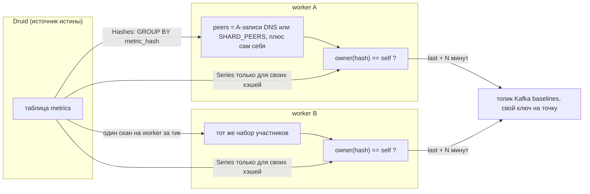

# POC: шардированный worker базовых линий на VM и в Kubernetes

[English version](POC.md)

Proof of concept для v2-модели масштабирования `timeseries-baselines`: **N процессов делят одну таблицу Druid
через rendezvous-хеширование по `metric_hash`** — без координатора, блокировок и общего состояния.
Описанное поведение: worker `052c1a8`, значение чарта `baselines.replicas`.

## Что доказывает этот POC

| Утверждение | Как проверяется здесь |
| --- | --- |
| Работа делится, а не дублируется | Два и более worker'а публикуют попарно **непересекающиеся** наборы хэшей, которые вместе покрывают все готовые хэши |
| Владение не требует координатора | Процессы не общаются друг с другом; общие системы — только Druid (источник работы) и Kafka (выход) |
| Масштабирование сдвигает мало | Добавление/удаление одного worker'а перемещает около `1/N` хэшей, остальные сохраняют владельца |
| Смена состава теряет не более одного тика | Новый владелец публикует свой `last + AHEAD_MINUTES` на ближайшем тике; бэкфилла нет |
| Дубликаты не портят значения | Ингест сворачивает повторный `(metric_hash, metric_ts)` (`doubleMax` со свёрткой по минутам), а дашборд читает `MAX(baseline_value)` |
| Неверный список участников виден сразу | Статический список с неработающим peer'ом оставляет его долю неопубликованной (негативный контроль, VM) |



Владение — это `owner(hash) = argmax(avalanche(fnv1a(hash | peer)))` по набору участников, поэтому каждый
worker получает один и тот же ответ, зная только этот набор.

## Предварительные требования

- Собранный `timeseries-baselines`: `make linux` (linux amd64 в `bin/baselines`) или `go build ./cmd/baselines` на VM
- Druid с таблицей `metrics` вида `{metric_hash, metric_ts → __time, metric_value}`, где хотя бы у одного хэша
  `max(__time) - min(__time) >= LOOKBACK` (по умолчанию `336h`) и шаг 1 минута
- Kafka с топиком `baselines`
- Druid Kafka supervisor для `baselines` с `"type": "doubleMax"` для `baseline_value`,
  `"queryGranularity": "minute"` и `"rollup": true` (см. `druid/baselines-supervisor.json` в песочнице)
  - Смена этого агрегатора требует большего, чем правка файла: нужно заново отправить спецификацию **и**
    переиндексировать источник (сбросить supervisor или пересобрать его). Rollup применяется при ингесте,
    поэтому уже сохранённые минуты сохраняют старую агрегацию — стенд, проиндексированный с `doubleSum`,
    хранит удвоенные значения, и никакой запрос дашборда это не исправит. Отправка спецификации влияет
    только на новый ингест.
- Опционально: стек песочницы (`make up`, `make refresh`) для дашборда и `make baselines`

| Переменная | Значение |
| --- | --- |
| `DRUID_BROKER`, `DRUID_DATASOURCE`, `KAFKA_BROKERS`, `KAFKA_TOPIC` | Как в v1 |
| `LOOKBACK`, `AHEAD_MINUTES`, `INTERVAL`, `CALENDAR` | Как в v1 |
| `SHARD_ID` | Идентификатор этого worker'а. По умолчанию: первый не-loopback IP |
| `SHARD_PEERS` | Список идентификаторов участников через запятую (режим VM) |
| `SHARD_DNS` | Имя, A-записи которого образуют набор участников (headless-сервис в Kubernetes, имя сервиса в Compose) |

Пустые `SHARD_PEERS` и `SHARD_DNS` означают, что все хэши принадлежат одному worker'у. Обе переменные
одновременно — ошибка на старте.

## Шаг 0 — локальная проверка, без Druid и Kafka (~1 с)

```bash
cd timeseries-baselines
go test ./... -run 'Shard|Owns|Peer|Publisher' -v
```

Ожидается: `TestPublisherWorkersOwnDisjointHashes` проходит (три worker'а делят хэши непересекающимися и
полными наборами), `TestOwnsPartitionsEveryHashOnce` — для 1..6 участников,
`TestOwnsSpreadsHashesAcrossSimilarPeers` — имена `worker-0..4` делят таблицу равномерно (это регрессия на
лавинность хэша: без неё владение следовало за именем peer'а, и одна смена состава двигала половину таблицы),
`TestPublisherTakesOverHashesAfterPeerLeaves` и `TestOwnsKeepsMostHashesWhenPeerAdded` — при добавлении
пятого участника перемещается примерно 1/5 хэшей.

Это тот же код владения, что работает в процессах: проверяется алгоритм и режимы набора участников,
а не развёртывание.

## Шаг 1 — VM: три worker'а со статическим списком участников

Режим: `SHARD_PEERS`. Идентификаторы — произвольные строки, поэтому достаточно `w0/w1/w2`, IP не нужны.

```bash
# /etc/baselines/env — общий для всех экземпляров
DRUID_BROKER=http://druid-broker:8082
DRUID_DATASOURCE=metrics
KAFKA_BROKERS=kafka-1:9092,kafka-2:9092
KAFKA_TOPIC=baselines
LOOKBACK=336h
AHEAD_MINUTES=1
INTERVAL=1m
SHARD_PEERS=w0,w1,w2
```

```ini
# /etc/systemd/system/baselines@.service
[Unit]
Description=Minute-of-week baselines worker (шард %i)
After=network-online.target

[Service]
EnvironmentFile=/etc/baselines/env
Environment=SHARD_ID=%i
ExecStart=/usr/local/bin/baselines
Restart=always
RestartSec=5
User=baselines

[Install]
WantedBy=multi-user.target
```

```bash
systemctl enable --now baselines@w0 baselines@w1 baselines@w2
journalctl -u 'baselines@*' -n 20 --no-pager   # каждый unit логирует свой шард
```

Ожидается в стартовой строке каждого экземпляра: `shard=w0 shardPeers="[w0 w1 w2]" shardDNS=""`
(и `w1`/`w2` соответственно), далее — тишина, пока стек здоров.

Два процесса на **одной машине** автоматически определили бы один и тот же идентификатор, поэтому при
статическом списке всегда задавайте `SHARD_ID` явно (в unit выше так и сделано). На разных VM тоже задавайте
идентификаторы явно: по умолчанию берётся первый non-loopback IP, а две VM в разных сетях могут сообщить один
и тот же приватный адрес — тогда они считаются одним участником и каждая дублирует долю другой.

Статический флот согласован только при одинаковой конфигурации всех worker'ов:

- **один и тот же** `SHARD_PEERS` (весь флот, включая себя) и уникальные `SHARD_ID`, иначе два worker'а
  вычислят разных владельцев для одного хэша;
- **один и тот же** `LOOKBACK`. Проверка пригодности выполняется *после* проверки владения, поэтому хэш,
  которым владеет worker с более коротким lookback, не публикует никто;
- одни и те же `DRUID_BROKER`, `DRUID_DATASOURCE`, `KAFKA_BROKERS` и `KAFKA_TOPIC` — иначе это не общая
  таблица, а независимые конвейеры.

Меняйте список **до** остановки процесса: имя в списке, за которым нет процесса, молча теряет свою долю.
Добавление worker'а безопасно в любом порядке — пока старый и новый списки расходятся, худший случай это
дубликат точки, который `doubleMax` сворачивает.

### Проверка разделения по данным

Kafka (дубликатов нет — это и есть утверждение для установившегося режима):

```bash
kafka-console-consumer.sh --bootstrap-server localhost:9092 --topic baselines \
  --from-beginning --timeout-ms 5000 \
  | jq -r '[.metric_hash, .metric_ts] | @tsv' | sort | uniq -cd
```

Ожидается: пусто. Любой вывод — повторяющиеся `(metric_hash, metric_ts)`, которые ингест обязан проглотить.

Покрытие в Druid (каждый готовый хэш продолжает получать опережающие точки):

```sql
SELECT metric_hash, COUNT(*) AS points, MAX(__time) AS last_point
FROM baselines
GROUP BY 1
ORDER BY 1
```

### Негативный контроль (VM) — участник, который не работает

```bash
systemctl stop baselines@w2
# затем на оставшихся хостах временно оставить остановленный peer в списке:
# SHARD_PEERS=w0,w1,w2, хотя работают только w0 и w1
```

Ожидается: `w0` и `w1` публикуют только свою долю, а доля `w2` **исчезает из Kafka**, пока `w2` не вернётся
или список не поправят. Это и есть описанная ловушка: статический список должен совпадать с работающими
процессами. Уберите `w2` из `SHARD_PEERS` (и перезапустите unit'ы), чтобы увидеть, как покрытие
восстанавливается за один тик — `w0`/`w1` забирают его долю без миграции данных.

## Шаг 2 — Kubernetes: масштабирование Deployment

Режим: `SHARD_DNS`. Чарт даёт worker'у собственный Deployment и headless-сервис: `SHARD_ID` — это IP пода
(`status.podIP`), а `SHARD_DNS` — короткое имя сервиса, которое резолвится через search-домены пода, поэтому
работает и на кластере с нестандартным `--cluster-domain`.

```bash
# из timeseries-k8s
make docker-baselines                     # собирает образ из закреплённого коммита worker'а
helm upgrade --install timeseries charts/timeseries -n timeseries --create-namespace \
  -f ../timeseries-grafana-sandbox/helm/timeseries-values.yaml \
  --set baselines.replicas=1
```

`docker/baselines/Dockerfile` забирает исходники worker'а с GitHub по закреплённому ref (`BASELINES_REF`),
поэтому перед сборкой образа этот коммит должен быть отправлен в remote — локального коммита недостаточно.

Проверка отрендеренных объектов до кластера (и без него):

```bash
helm template test charts/timeseries -f ci/values.yaml --set baselines.replicas=3 | \
  grep -E "name: test-baselines|replicas:|SHARD_|clusterIP"
```

Ожидается: `Service` `test-baselines-headless` с `clusterIP: None`, `Deployment` `test-baselines` с
`replicas: 3` и переменные `SHARD_ID` (`fieldRef: status.podIP`) / `SHARD_DNS`.

Масштабирование и просмотр участников:

```bash
kubectl -n timeseries scale deployment/timeseries-baselines --replicas=3
kubectl -n timeseries get pods -l app.kubernetes.io/component=baselines -o wide
kubectl -n timeseries get endpoints timeseries-baselines-headless
kubectl -n timeseries logs -l app.kubernetes.io/component=baselines --tail=1
```

Ожидается: три пода с тремя разными IP, в списке endpoint'ов headless-сервиса — ровно эти IP, и три
стартовые строки вида `shard=<ip пода> shardDNS=timeseries-baselines-headless...`. Идентификаторы в логах
совпадают с IP из endpoint'ов один в один.

### Проверка разделения изнутри кластера

```bash
kubectl -n timeseries run dnstest --rm -it --restart=Never --image=busybox:1.36 \
  -- nslookup timeseries-baselines-headless
```

Ожидается: по одному адресу на каждый работающий под. Это и есть весь механизм состава: worker'ы читают
DNS-запись сервиса и никогда не обращаются друг к другу.

### Смена состава

```bash
kubectl -n timeseries scale deployment/timeseries-baselines --replicas=5   # больше мощности, сдвиг ~1/5
kubectl -n timeseries scale deployment/timeseries-baselines --replicas=2   # меньше worker'ов, сдвиг ~1/3
kubectl -n timeseries rollout restart deployment/timeseries-baselines       # новые IP подов: сдвиг ~1/N дважды
```

Ожидается после каждого изменения: выжившие и новые worker'ы забирают свою долю на ближайшем тике. При
масштабировании вверх или рестарте часть хэшей один тик публикуют и старый, и новый владелец — ингест их
сворачивает. При уменьшении числа реплик доля ушедшего молчит не более одного тика.

`kubectl scale` меняет только текущее число реплик: следующий `helm upgrade` вернёт `replicas` к значению
`baselines.replicas`, поэтому задавайте нужное число там (`--set baselines.replicas=N`) или повторите
масштабирование после апгрейда.

### Негативный контроль (k8s) — один и тот же идентификатор дважды

```bash
kubectl -n timeseries set env deployment/timeseries-baselines SHARD_DNS=   # теперь каждый под владеет всем
# позже:
kubectl -n timeseries set env deployment/timeseries-baselines SHARD_DNS=timeseries-baselines-headless
```

Ожидается: без обнаружения участников каждый под публикует каждый хэш — проверка на дубликаты ниже
наполняется повторами, а `MAX(baseline_value)` в Druid **не меняется**. В этом и смысл контракта
идемпотентности: дублирующая работа расточительна, но безвредна.

## Шаг 3 — проверка, что дубликаты не удваивают значение

Возьмите минуту базовой линии из прогона с одной репликой и повторите с тремя (окно должно быть покрыто
обоими прогонами и быть старше `now - AHEAD_MINUTES`):

```sql
SELECT __time, MAX(baseline_value) AS baseline_value
FROM baselines
WHERE metric_hash = 'ready'
  AND __time >= MILLIS_TO_TIMESTAMP(1789000000000)
  AND __time <= MILLIS_TO_TIMESTAMP(1789003600000)
GROUP BY 1
ORDER BY 1
```

Ожидается: одинаковые значения для минут, которые в обоих прогонах старше `now - AHEAD_MINUTES` (подгонка
детерминирована при одинаковом окне входных данных). Во время передачи доли два владельца могут подогнать
слегка разные окна и опубликовать два значения на одну минуту; берётся большее, но никогда их сумма.

Если поднят дашборд песочницы, панель **Metrics vs baselines** — та же проверка глазами: линия метрики и
опережающая линия базовой линии держат одно и то же расстояние и при 1, и при 3 worker'ах.

## Что уже проверено, а что требует вашего стенда

Проверено двумя реальными процессами против заглушки Druid (шесть готовых хэшей):

- Статические участники (`w0,w1`) → `w0: m0 m2 m4`, `w1: m1 m3 m5` — непересекающиеся, полные, стабильные между тиками
- Обнаружение через DNS реальным резолвером (`SHARD_DNS=localhost`, идентификаторы `127.0.0.1` и `::1`) →
  `m1 m3 m5` и `m0 m2 m4`
- Неоднозначная конфигурация отклоняется: `set either SHARD_PEERS or SHARD_DNS, not both`, код выхода 1
- Один скан готовности на worker за тик, и ни одного `Series`-запроса по хэшу, которым worker не владеет

Требует вашего окружения:

- Поведение rollup в Druid (сворачивание повторной точки при `doubleMax`) — настроить и один раз посмотреть
- Runtime Kubernetes: тайминги endpoint'ов и DNS при rolling update и команды масштабирования выше
- Unit'ы для VM: рецепт — шаблон, поправьте пользователя и пути

## Известные ограничения

- **Скан готовности не шардируется.** Каждый worker раз в тик выполняет `GROUP BY metric_hash` по всей
  таблице, то есть N worker'ов дают N сканов; делятся только `Series`-загрузка и подгонка по своим хэшам.
  При 1–4 мс на подгонку один worker всё ещё обрабатывает тысячи хэшей в минуту, поэтому следить нужно за
  сканом, а не за CPU.
- **Бэкфилла нет.** Рестарт, смена состава или пропущенный тик стоят одной опережающей точки; следующий тик
  публикует текущую.
- **Идентификатор должен быть уникальным.** Процессы на одной машине и любые ручные переопределения не
  должны совпадать, иначе они дважды публикуют одну долю (безвредно, но расточительно), а при устаревшем
  списке хэши остальных участников остаются неопубликованными.
- **Ингест обязан оставаться идемпотентным.** Сохраняйте `doubleMax`/`MAX`, иначе передача доли
  превратится в удвоенную базовую линию.
- **Нет HTTP-эндпоинта и проб**, поэтому состав следует за готовностью подов, а не за health-check'ом.

## Очистка

```bash
systemctl disable --now 'baselines@*'                       # VM
kubectl -n timeseries scale deployment/timeseries-baselines --replicas=1
helm -n timeseries uninstall timeseries                     # или оставить стек
```
